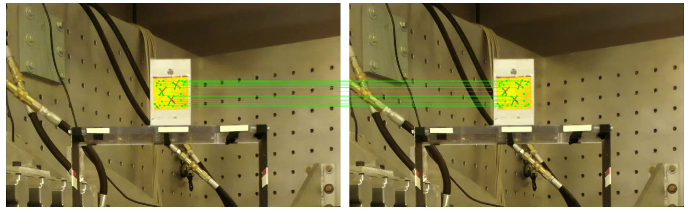

# Robust Tracking of Displacement of ROI in Videos using LightGlue and SuperPoint DL Models

This repository contains a Python script for robust tracking of displacement in videos using the LightGlue and SuperPoint deep learning models.
## Features

- **LightGlue Model**: Utilizes the LightGlue model for efficient feature matching.
- **SuperPoint Model**: Employs the SuperPoint model for detecting and describing interest points.
- **Robust Tracking**: Provides accurate and reliable tracking of displacement in videos.
- **Easy Integration**: The script is designed for easy integration into existing video processing workflows.

## Requirements

To run the script, you will need the following dependencies:

- Python 3.7+
- OpenCV
- PyTorch
- NumPy
- SciPy
- Matplotlib

## License

This project is licensed under the MIT License - see the [LICENSE](LICENSE) file for details.

## Acknowledgements

- The [LightGlue](https://github.com/cvg/LightGlue) model used in this script.
